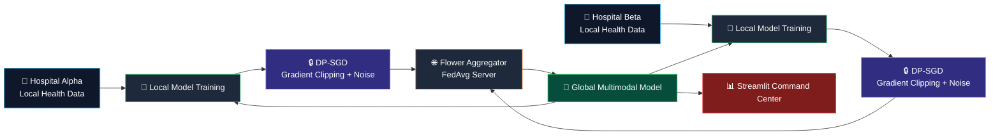
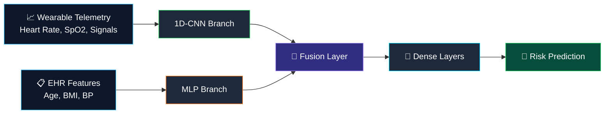
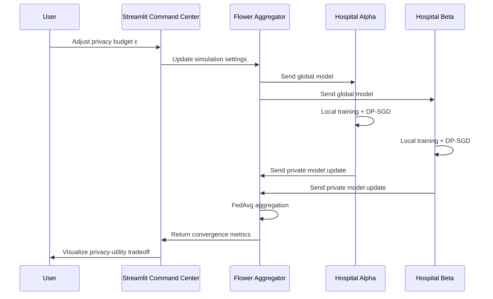

<div align="center">


<br/>


<br/>
<br/>

[](#)
[](https://pytorch.org/)
[](https://flower.ai/)
[](https://opacus.ai/)
[](https://www.docker.com/)
[](https://streamlit.io/)

<br/>


<br/>
<br/>

**Architect:** [Dhrumil Rana](https://github.com/dhrumilrana25)
**Affiliation:** University of Texas at Arlington — MS in Data Science
**Focus:** Federated Learning, Differential Privacy, Multimodal Health AI, Distributed Systems

</div>

---

<br/>

<div align="center">

## 🛑 The Problem: The Privacy Paradox


</div>

<br/>

Modern healthcare AI faces a major bottleneck: **data silos**.

Hospitals, clinics, research labs, and wearable health platforms collect valuable data, but that data cannot simply be centralized because it may contain sensitive patient information.

Healthcare AI needs large, diverse datasets to detect global health patterns, but privacy regulations and institutional boundaries restrict raw data sharing.

The result is the **privacy paradox**:

> AI needs more data to become useful, but the most valuable data is often the hardest to move.

<br/>

<table>
<tr>
<td width="50%" valign="top">

### The Traditional Problem

* Raw patient data is centralized
* Privacy and compliance risk increases
* Data sharing agreements become complex
* Institutions lose control over local data
* AI models remain limited by fragmented access

</td>

<td width="50%" valign="top">

### The Aegis-Federate Approach

* Raw data stays inside local institutions
* Models travel to the data
* Only model updates are shared
* Differential Privacy reduces leakage risk
* Global learning happens without centralizing records

</td>
</tr>
</table>

<br/>

---

<br/>

<div align="center">

## ✅ The Solution: Aegis-Federate

</div>

<br/>

**Aegis-Federate** is a containerized, privacy-preserving federated learning system for multimodal health intelligence.

Instead of moving sensitive medical data to a central server, Aegis-Federate moves the model to each local hospital node.

Each edge node trains locally on its own data, then sends privacy-aware model updates to a central aggregator. The global model improves across institutions while raw patient data remains local.

<br/>

<div align="center">


</div>

<br/>

---

<br/>

<div align="center">

## 🏗️ Federated System Architecture


</div>

<br/>



<br/>

---

<br/>

<div align="center">

## ✨ Key Architectural Highlights

</div>

<br/>

<table>
<tr>
<td width="50%" valign="top">

## 🧠 1. Multimodal Fusion Architecture

Aegis-Federate uses a dual-branch neural network that combines time-series telemetry with structured health records.

### Telemetry Branch

A **1D Convolutional Neural Network** processes high-frequency temporal signals from wearable-style health telemetry.

Example signals:

* Heart rate
* SpO₂
* Respiratory trends
* Time-dependent physiological patterns

### EHR Branch

A **Multi-Layer Perceptron** processes static electronic health record features.

Example features:

* Age
* BMI
* Blood pressure
* Clinical risk indicators

</td>

<td width="50%" valign="top">

## 🔗 Fusion Layer

The model merges both branches through a dense fusion layer.

This allows the model to learn from:

* Temporal health signals
* Static clinical context
* Cross-modal interactions
* Combined patient risk representations

### Why It Matters

Single-modality models can miss important signals.

A multimodal architecture can better capture patient-level risk by learning from both continuous telemetry and structured health features.

</td>
</tr>
</table>

<br/>



<br/>

---

<br/>

<div align="center">

## 🔒 Differential Privacy with Opacus

</div>

<br/>

Aegis-Federate integrates **Meta Opacus** to reduce the risk of sensitive information leakage from model updates.

The system uses **Differentially Private Stochastic Gradient Descent**, also known as **DP-SGD**.

<br/>

<table>
<tr>
<td width="50%" valign="top">

### What DP-SGD Does

* Clips gradients to limit individual influence
* Adds calibrated noise to updates
* Tracks privacy budget over training
* Reduces membership inference risk
* Reduces model inversion risk

</td>

<td width="50%" valign="top">

### Privacy Parameters

Differential Privacy is controlled through:

* **ε / epsilon:** privacy budget
* **δ / delta:** probability of privacy failure
* **Noise multiplier:** amount of added noise
* **Max gradient norm:** clipping threshold

</td>
</tr>
</table>

<br/>

> Differential Privacy does not mean “zero risk.” It provides a formal mathematical privacy guarantee that bounds the influence of any single training example on the final model.

<br/>

---

<br/>

<div align="center">

## 🏥 Containerized Cross-Silo Orchestration


</div>

<br/>

Aegis-Federate is structured as a distributed system using Docker Compose.

<table>
<tr>
<td width="33%" valign="top">

### 🌐 Aggregator

The central coordination server.

**Responsibilities**

* Orchestrates federated rounds
* Aggregates client updates
* Runs FedAvg
* Distributes global model weights

</td>

<td width="33%" valign="top">

### 🏥 Edge Nodes

Independent hospital clients.

**Examples**

* Hospital Alpha
* Hospital Beta

**Responsibilities**

* Keep data local
* Train local models
* Apply DP-SGD
* Send model updates only

</td>

<td width="33%" valign="top">

### 📊 Command Center

Real-time monitoring dashboard.

**Responsibilities**

* Visualize training rounds
* Track privacy-utility tradeoff
* Monitor convergence
* Display risk clusters

</td>
</tr>
</table>

<br/>

---

<br/>

<div align="center">

## 📊 Interactive Command Center

</div>

<br/>

The Streamlit dashboard acts as a **Privacy-Utility Simulator** for federated health AI.

Users can:

* Adjust the **privacy budget ε**
* Observe the tradeoff between privacy and model performance
* Monitor federated training rounds
* Track global convergence
* Visualize differentially private risk clusters
* Explore interactive Plotly charts and maps

<br/>



<br/>

---

<br/>

<div align="center">

## 🛠️ Tech Stack

<br/>


<br/>
<br/>

</div>

<table>
<tr>
<td width="33%" valign="top">

### 🤖 Deep Learning


</td>

<td width="33%" valign="top">

### 🔐 Privacy + FL


</td>

<td width="33%" valign="top">

### 🏗️ Infrastructure


</td>
</tr>
</table>

<br/>

---

<br/>

<div align="center">

## 🚀 Quick Start

</div>

<br/>

### 1. Clone the Repository

```bash id="ddp0ve"
git clone https://github.com/dhrumilrana25/Aegis-Federate.git
cd Aegis-Federate
```

### 2. Build and Start the Federated System

```bash id="1bqc5m"
docker compose up --build
```

### 3. Start Federated Training

Depending on your project entrypoint, run the aggregator and clients through Docker Compose or separate terminals.

Example local flow:

```bash id="oovl2y"
python server.py
```

```bash id="zgwmcc"
python client_alpha.py
```

```bash id="r4y8z7"
python client_beta.py
```

### 4. Launch the Dashboard

```bash id="xttcmn"
streamlit run dashboard.py
```

<br/>

---

<br/>

<div align="center">

## 📁 Suggested Repository Structure

</div>

<br/>

```txt id="hzug3t"
Aegis-Federate/
│
├── server/
│   ├── server.py
│   └── aggregation.py
│
├── clients/
│   ├── hospital_alpha.py
│   ├── hospital_beta.py
│   └── client_utils.py
│
├── models/
│   ├── multimodal_model.py
│   ├── telemetry_cnn.py
│   └── ehr_mlp.py
│
├── privacy/
│   ├── dp_engine.py
│   └── privacy_accounting.py
│
├── dashboard/
│   ├── app.py
│   └── visualizations.py
│
├── data/
│   ├── hospital_alpha/
│   └── hospital_beta/
│
├── docker-compose.yml
├── Dockerfile
├── requirements.txt
└── README.md
```

<br/>

---

<br/>

<div align="center">

## 🔐 Threat Model

</div>

<br/>

| Risk                         | Mitigation                                             |
| ---------------------------- | ------------------------------------------------------ |
| Raw patient data exposure    | Data remains local to each hospital node               |
| Centralized data breach      | No central raw-data lake is created                    |
| Model inversion attacks      | DP-SGD reduces leakage from gradients                  |
| Membership inference attacks | Privacy accounting bounds individual contribution risk |
| Cross-client data leakage    | Clients train in isolated containers                   |
| Uncontrolled collaboration   | Federated server coordinates only model updates        |

<br/>

---

<br/>

<div align="center">

## 📈 Metrics Tracked

</div>

<br/>

Aegis-Federate can be monitored through the Command Center dashboard.

| Metric                | Purpose                                               |
| --------------------- | ----------------------------------------------------- |
| **Federated Round**   | Tracks global training progress                       |
| **Local Loss**        | Measures each hospital node’s training behavior       |
| **Global Accuracy**   | Evaluates aggregated model performance                |
| **Privacy Budget ε**  | Tracks privacy-utility tradeoff                       |
| **Noise Multiplier**  | Controls differential privacy strength                |
| **Convergence Curve** | Visualizes model improvement over rounds              |
| **Risk Cluster Map**  | Shows differentially private risk group visualization |

<br/>

---

<br/>

<div align="center">

## 🧭 Roadmap


</div>

<br/>

### Current

* [x] Cross-silo federated learning
* [x] Two-node Docker orchestration
* [x] Multimodal CNN + MLP model
* [x] Differential Privacy with Opacus
* [x] Streamlit command center
* [x] Plotly-based interactive visualizations

### Next

* [ ] Secure Multi-Party Computation
* [ ] Secure aggregation protocol
* [ ] More client nodes
* [ ] Model checkpoint registry
* [ ] Advanced privacy accounting
* [ ] Client failure simulation

### Scale

* [ ] Kubernetes orchestration
* [ ] Horizontal scaling to thousands of edge nodes
* [ ] Federated monitoring service
* [ ] Production-style API gateway
* [ ] Deployment-ready FL infrastructure

<br/>

---

<br/>

<div align="center">

## ⚖️ Responsible Use & Compliance Note

</div>

<br/>

This project is designed for educational and research purposes in privacy-preserving machine learning.

Aegis-Federate demonstrates techniques relevant to privacy-sensitive health AI, including federated learning and differential privacy. However, this repository should not be treated as a certified HIPAA, GDPR, or clinical compliance system without formal legal, security, and institutional review.

Do not use real patient data unless you have proper authorization, governance, security controls, and compliance approval.

<br/>

---

<br/>

<div align="center">

## 📈 Repository Stats

<br/>


<br/>
<br/>


</div>

<br/>

---

<br/>

<div align="center">

## 👨‍💻 Developer

<br/>


<br/>
<br/>

[](https://www.linkedin.com/in/dhrumil-rana-265316232/)
[](mailto:dhrumilrana25@gmail.com)
[](https://github.com/dhrumilrana25)

<br/>
<br/>

### “Move intelligence across institutions without moving sensitive data.”

<br/>


</div>
